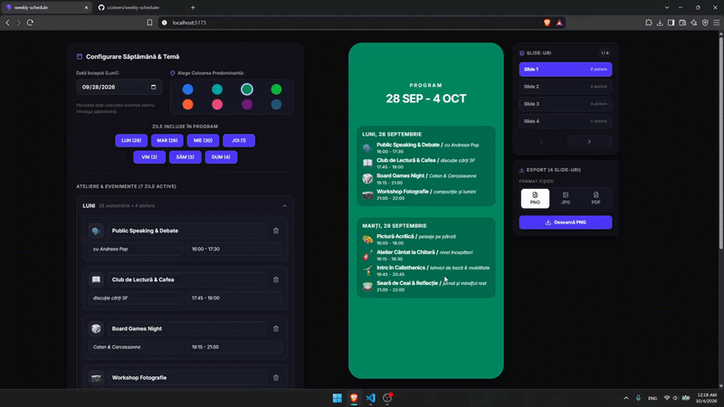
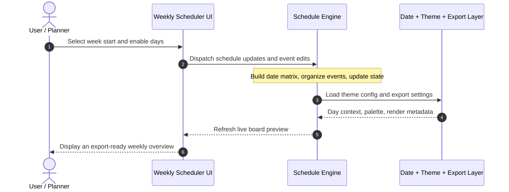

<div align="center">

# Weekly Scheduler

**Weekly Scheduler helps teams, educators, and event organizers turn a busy week into a polished, export-ready schedule without manual spreadsheet cleanup**

[](https://vite.dev/)
[](https://react.dev/)
[](https://www.typescriptlang.org/)
[](#-license--author)

</div>

<p align="center">
  
</p>

---

## 📌 Problem & Motivation

Planning a week of workshops, sessions, or recurring activities often means juggling calendars, notes, and visual exports across multiple tools. Small changes can ripple through the whole schedule, creating inconsistent timings, missing days, and last-minute formatting issues that slow everyone down.

**Weekly Scheduler** addresses this by streamlining the entire workflow:

- **Designs a cleaner planning flow:** It turns a raw weekly plan into a structured schedule you can edit quickly without breaking the layout.
- **Keeps the visual output polished:** Themes, day selections, and export-ready cards are generated in one place so the final result stays consistent.
- **Improves planning speed:** One interface lets you adjust dates, toggle active days, and manage events without manual spreadsheet work.

---

## ✨ Key Features

- **⚡ Weekly Planning Editor:** Create, update, and remove workshop blocks with a focused scheduling UI designed for fast iteration.
- **🎨 Theme-Driven Visuals:** Switch between curated color palettes to match the mood or branding of each weekly plan.
- **🔒 Structured Event Management:** Keep event titles, descriptions, and time slots organized by day with cleaner validation for each entry.
- **📱 Export-Ready Schedule Board:** Generate a polished preview and export the final layout as a presentation-style visual for sharing or printing.

---

## 🧠 Architecture & How It Works



## 🛠️ Tech Stack

**Frontend / Client**
React 19 + TypeScript
Responsive, state-driven weekly planner UI with reusable editor and preview components.

**Language & Runtime**
TypeScript 5 / Node.js 20+
Modern typed development with Vite-based fast iteration and hot module reload.

**State / Architecture**
Component-driven state management
Schedule data is composed in-memory, then rendered across editor and preview surfaces without losing consistency.

**APIs & Tooling**
`date-fns`, `lucide-react`, `Tailwind CSS`, `html2canvas`, `jspdf`
Utilities for date calculations, layout styling, and export workflows.

**Deployment / Target**
Web application
Runs locally in the browser and is designed for quick schedule generation and sharing.

## 🚀 Getting Started

### Prerequisites

- **Runtime / SDK:** Node.js 20+
- **Package Manager / Build Tool:** npm
- **Browser Access:** A modern browser with local file access for previewing the generated schedule

### 1. Installation

```bash
git clone https://github.com/coxteen/weekly-scheduler.git
cd weekly-scheduler
npm install
```

### 2. Environment Configuration

This project does not require external API credentials for local development. The default workflow uses the built-in schedule configuration and theme presets.

### 3. Running Locally / Building

```bash
npm run dev
```

Open [`http://localhost:5173`](http://localhost:5173) in your browser to edit and preview the weekly schedule.

## ⚙️ Configuration

Key scheduling and styling settings live in the app source, especially in the schedule model and theme definitions:

```ts
export const CONFIG = {
  maxThreshold: 3,
  debounceDelayMs: 1200,
  enableDebugLogging: false,
};
```

In this project, the main customization points are the weekly date range, enabled days, theme palette, and event cards defined in `src/types/schedule.ts`, `src/data/themes.ts`, and `src/constants/posterThemeConfig.ts`.

## 📄 License & Author

- **Author:** [Costin Ghiujan](https://github.com/coxteen)
- **License:** Released under the [MIT License](LICENSE).
